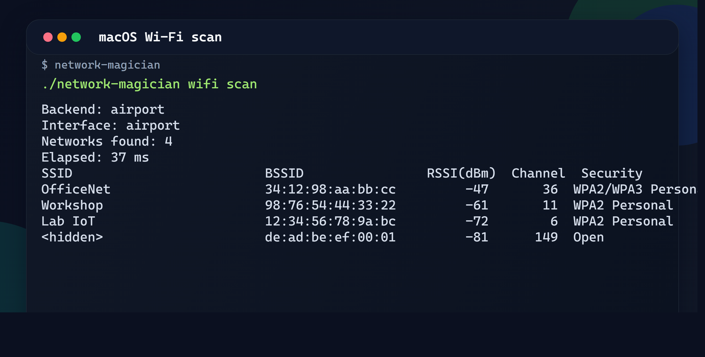
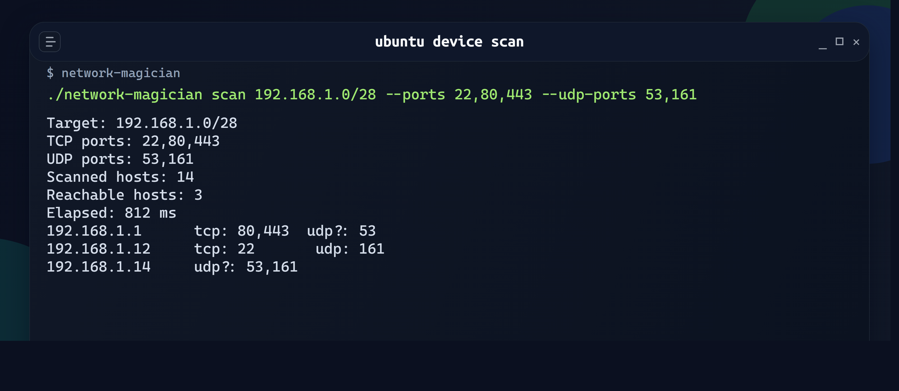
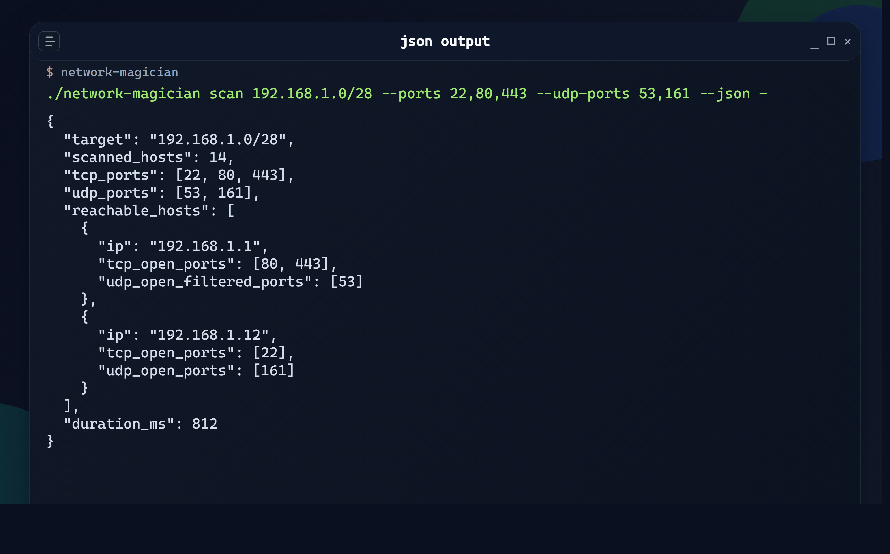

# network-magician

[](https://github.com/aykutsp/network-magician/actions/workflows/ci.yml)


[](LICENSE)

`network-magician` is a Rust CLI for quick LAN checks. It scans a CIDR block, a plain IPv4 range, or a single host, probes selected TCP and UDP ports, and can also list nearby Wi-Fi networks with channel and signal details.

It exists for the in-between jobs that do not need a full network inventory stack: checking which lab devices are up, verifying a small service rollout, or taking a repeatable snapshot before and after a network change.

## Quick start

Build a release binary:

```bash
cargo build --release
```

Run a mixed TCP and UDP scan:

```bash
./target/release/network-magician scan 192.168.1.0/24 --ports 22,80,443 --udp-ports 53,161
```

List nearby Wi-Fi networks:

```bash
./target/release/network-magician wifi scan
```

## Screenshots

macOS Wi-Fi scan:



Linux device scan with TCP and UDP results:



JSON output:



## Features

- Scan a CIDR target such as `192.168.1.0/24`
- Scan a direct IPv4 range such as `192.168.1.10-192.168.1.50`
- Probe a single host when you only need a quick service check
- Accept explicit TCP and UDP port lists or ranges
- Show each discovered device together with its TCP and UDP results
- Mark UDP ports that look `open|filtered` when there is no direct reply
- Scan nearby Wi-Fi networks and show channel plus signal strength
- Print a compact terminal summary with elapsed time
- Write scan reports as JSON for later diffing or automation
- Compare two saved reports with `diff`

## Build and install

### Build from source

```bash
cargo build --release
```

The binary will be available at:

```bash
./target/release/network-magician
```

### Run without installing

```bash
cargo run -- scan 192.168.1.0/24
```

## Why this tool

`network-magician` is aimed at the practical middle ground between a one-off socket check and a heavier network inventory stack. It is useful when you want a fast answer to questions like:

- Which hosts in this range respond on the ports I actually care about?
- Which devices exposed new services after a rollout?
- Which Wi-Fi networks are visible here, and what channel are they using?

## Usage

```text
network-magician scan <TARGET> [--ports <TCP_PORTS>] [--udp-ports <UDP_PORTS>] [--timeout-ms <MS>] [--concurrency <N>] [--no-progress] [--json <PATH>]
network-magician diff <OLD_REPORT.json> <NEW_REPORT.json>
network-magician wifi scan [--json <PATH>]
```

`TARGET` can be one of:

- a CIDR block like `192.168.1.0/24`
- an IPv4 range like `192.168.1.20-192.168.1.40`
- a single host like `192.168.1.15`

`--ports` and `--udp-ports` accept individual ports and ranges:

```bash
--ports 22,80,443,8000-8010
```

## Examples

Scan a subnet with the default port set:

```bash
network-magician scan 192.168.1.0/24
```

Scan a smaller host range with specific ports:

```bash
network-magician scan 192.168.1.10-192.168.1.40 --ports 22,80,443,502
```

Scan both TCP and UDP ports:

```bash
network-magician scan 192.168.1.0/24 --ports 22,80,443 --udp-ports 53,161
```

Probe one host and write the report to disk:

```bash
network-magician scan 192.168.1.15 --ports 22,443,8443 --json reports/edge-router.json
```

Emit JSON to stdout:

```bash
network-magician scan 192.168.1.15 --ports 22,443 --udp-ports 53 --json -
```

Compare two saved reports:

```bash
network-magician diff reports/before.json reports/after.json
```

List nearby Wi-Fi networks:

```bash
network-magician wifi scan
```

Save a Wi-Fi scan as JSON:

```bash
network-magician wifi scan --json reports/wifi.json
```

## Example output

```text
Target: 192.168.1.0/24
TCP ports: 22,80,443
UDP ports: 53,161
Scanned hosts: 254
Reachable hosts: 3
Elapsed: 741 ms

192.168.1.1      tcp: 80,443  udp?: 53
192.168.1.12     tcp: 22      udp: 161
192.168.1.14     udp?: 53,161
```

## Limitations

- Host discovery is inferred from successful TCP connects and UDP probe behavior on the requested ports.
- Devices that do not expose any of the scanned ports may not appear as reachable.
- UDP results are best-effort. A `udp?` entry means the probe got no explicit rejection, which usually maps to `open|filtered` rather than a confirmed open socket.
- The tool does not use ARP, ICMP echo, or raw sockets.
- The current implementation targets IPv4 local network use cases.
- Wi-Fi scanning depends on a platform command being available: `netsh` on Windows, `airport` on macOS, or `nmcli` on Linux.

## Validation

The repository includes a small cross-platform CI workflow and local parser tests for target parsing, TCP/UDP option parsing, diff output, and Wi-Fi command parsing.

## Project layout

```text
.
├── Cargo.toml
├── Cargo.lock
├── LICENSE
├── README.md
├── assets
│   ├── json-output.png
│   ├── linux-device-scan.png
│   └── macos-wifi.png
├── src
│   ├── cli.rs
│   ├── lib.rs
│   ├── main.rs
│   ├── model.rs
│   ├── output.rs
│   ├── scanner.rs
│   ├── target.rs
│   ├── util.rs
│   └── wifi.rs
└── tests
    ├── model_tests.rs
    ├── target_tests.rs
    ├── util_tests.rs
    └── wifi_tests.rs
```

## Notes

Use this tool only on networks you own or are authorized to inspect.
